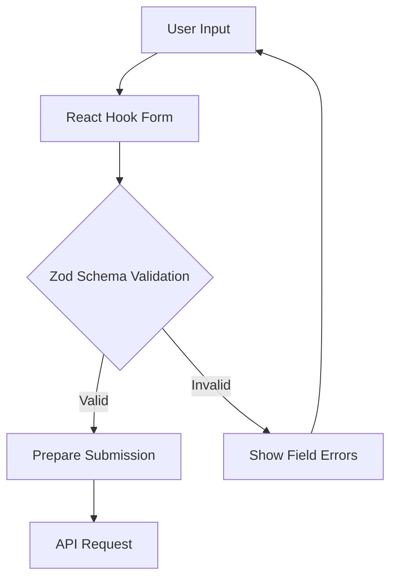
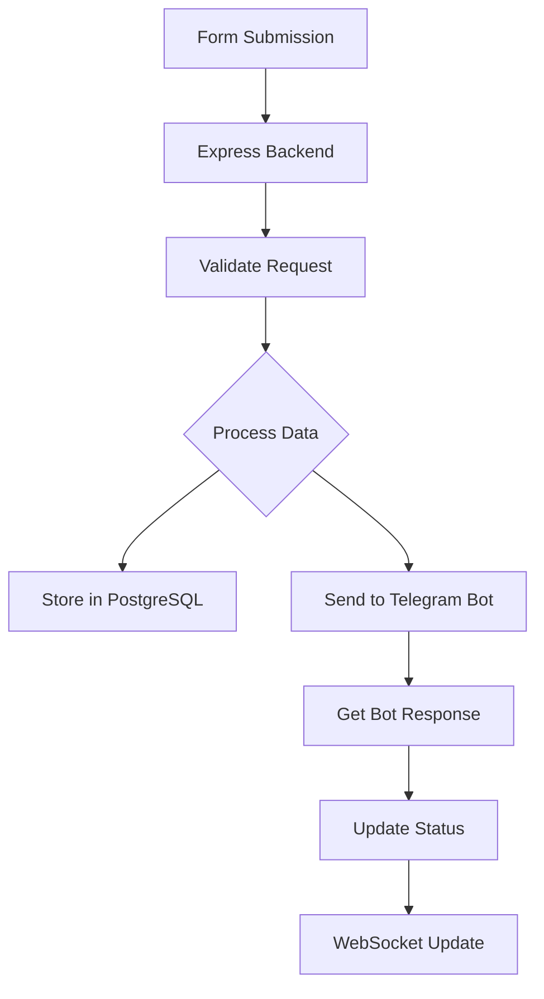

# Technical Process Flow

This document outlines the detailed technical process flow of the Telegram AI Chart Request Form application.

## 1. Form Submission Flow

### 1.1 Client-Side Validation


### 1.2 Data Processing


## 2. Component Architecture

### 2.1 Frontend Components
```
TelegramAiChartRequestForm/
├── client/
│   ├── src/
│   │   ├── components/
│   │   │   ├── telegram-bot-form.tsx    # Main form component
│   │   │   ├── status-display.tsx       # Status display
│   │   │   ├── submission-history.tsx   # History component
│   │   │   └── ui/                      # Reusable UI components
│   │   ├── hooks/                       # Custom hooks
│   │   ├── api/                         # API integration
│   │   └── pages/                       # Page components
```

### 2.2 Backend Structure
```
TelegramAiChartRequestForm/
├── server/
│   ├── routes/
│   │   ├── submissions.ts   # Submission endpoints
│   │   └── status.ts       # Status endpoints
│   ├── services/
│   │   ├── telegram.ts     # Telegram bot integration
│   │   └── database.ts     # Database operations
│   └── websocket/
│       └── status.ts       # WebSocket handlers
```

## 3. Data Flow

### 3.1 Form Submission
1. User fills form with:
   - Personal information
   - Trading instruments selection
   - Custom indicators
   - Access level

2. Client-side validation:
   ```typescript
   const formSchema = z.object({
     requesterName: z.string().min(2),
     telegramPhone: z.string().regex(/^\+[0-9]{10,}$/),
     equityIndices: z.array(z.string()),
     forex: z.array(z.string()),
     commodities: z.array(z.string()),
     customIndicators: z.string(),
     premiumAccess: z.enum(['roboClient', 'other']),
     otherAccess: z.string().optional(),
     specialInstructions: z.string()
   });
   ```

3. API submission:
   ```typescript
   const submission = await createBotSubmission(formData);
   ```

### 3.2 Server Processing
1. Receive submission:
   ```typescript
   app.post('/api/submissions', async (req, res) => {
     const submission = await processSubmission(req.body);
     await notifyTelegramBot(submission);
     res.json({ success: true, submissionId: submission.id });
   });
   ```

2. Database storage:
   ```typescript
   const storeSubmission = async (data) => {
     return await db.insert(submissions).values(data).returning();
   };
   ```

3. Telegram notification:
   ```typescript
   const notifyTelegramBot = async (submission) => {
     const bot = new TelegramBot(BOT_TOKEN);
     await bot.sendMessage(ADMIN_CHAT_ID, formatSubmission(submission));
   };
   ```

## 4. Real-time Updates

### 4.1 WebSocket Implementation
```typescript
// Server-side
const ws = new WebSocket.Server({ server });

ws.on('connection', (socket) => {
  socket.on('message', (message) => {
    const { submissionId } = JSON.parse(message);
    subscribeToUpdates(submissionId, socket);
  });
});

// Client-side
const socket = new WebSocket('ws://localhost:5000/ws/status');
socket.onmessage = (event) => {
  const update = JSON.parse(event.data);
  updateSubmissionStatus(update);
};
```

### 4.2 Status Updates
1. Status types:
   ```typescript
   type SubmissionStatus =
     | 'pending'
     | 'processing'
     | 'approved'
     | 'rejected'
     | 'completed';
   ```

2. Update flow:
   ```mermaid
   graph LR
     A[Submit] --> B[Pending]
     B --> C[Processing]
     C --> D{Decision}
     D -- Accept --> E[Approved]
     D -- Reject --> F[Rejected]
     E --> G[Completed]
   ```

## 5. Error Handling

### 5.1 Client-Side Errors
- Form validation errors
- Network request failures
- WebSocket connection issues

### 5.2 Server-Side Errors
- Database connection errors
- Telegram bot communication failures
- Invalid request data

### 5.3 Error Response Format
```typescript
interface ErrorResponse {
  status: number;
  message: string;
  details?: {
    field?: string;
    error: string;
  }[];
}
```

## 6. Security Measures

1. Input Validation
   - Strict schema validation
   - XSS prevention
   - SQL injection protection

2. Authentication
   - Rate limiting
   - Request validation
   - Session management

3. Data Protection
   - Encrypted storage
   - Secure communication
   - Access control

## 7. Monitoring and Logging

1. Application Metrics
   - Request latency
   - Error rates
   - Submission success rate

2. System Logs
   - Access logs
   - Error logs
   - Audit trails

3. Performance Monitoring
   - Database queries
   - API response times
   - WebSocket connections 